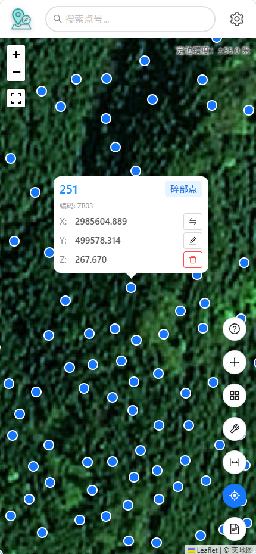
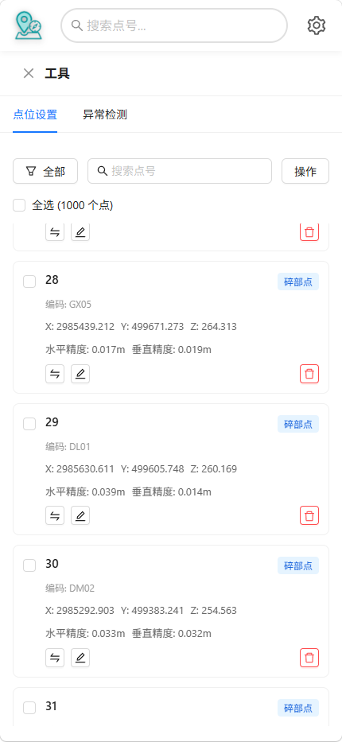

# MapPin - 测绘数据可视化平台

<div align="center">

**测绘数据可视化工具，让测量点管理变得简单高效**

<p align="center">
  
  
  
  
  
</p>

</div>

---

MapPin 是一个功能强大的测绘数据可视化 Web 应用程序，专为移动端和桌面端设计，用于展示、管理和分析测量点数据。

<div align="center">
  
  
</div>

> 演示和项目中的测试数据均由 `tools/generate_test_data.py` 生成

## ✨ 核心功能

### 📱 PWA 支持
- **安装到桌面**：可像原生 App 一样安装到手机/电脑桌面
- **离线访问**：支持离线使用，无需网络连接
- **智能缓存**：地图瓦片和静态资源自动缓存

### 📁 文件管理
- **文件导入**：支持 .dat 格式文件上传（简单格式和详细格式）
- **文件创建**：直接创建空白文件并手动添加点位
- **回收站**：误删文件可从回收站恢复
- **文件导出**：支持导出为 .dat 格式，可自定义导出内容

### 🗺️ 地图展示
- **多种底图**：OpenStreetMap、天地图（矢量/影像/地形）
- **底图切换**：地图模式 / 网格模式
- **智能聚合**：大量点位自动聚合，提升性能
- **点位标签**：可选显示点位号悬浮标签

### 📍 点位管理
- **点位类型**：碎部点（蓝色）/ 控制点（红色）
- **点位操作**：重命名、删除、类型切换
- **手动添加**：基于当前位置或自定义坐标添加点位
- **点位搜索**：快速搜索和定位点位
- **点位筛选**：按类型筛选（全部/碎部点/控制点/手动点）
- **点位设置**：批量管理和编辑点位信息

### 🏷️ 地名搜索
- **地名搜索**：搜索具体地点（如"北京大学"）
- **周边搜索**：两种方式触发，意图词触发（如"附近的+地名：附近的餐厅），类别词触发（如"超市"）
- **距离显示**：显示搜索结果到当前位置的距离

### 📏 测量工具
- **距离测量**：测量任意两点间的空间距离和平面距离
- **高差计算**：自动计算两点间的高程差

### 🔍 异常检测
- **精度异常**：检测 HRMS/VRMS 超标点位
- **孤立点检测**：识别距离其他点过远的孤立点
- **统计分析**：显示总点数、异常数、平均精度等统计信息
- **分类展示**：按异常类型分组显示，支持定位和导出

### 🌐 坐标系统
- **多坐标系支持**：CGCS2000、Beijing54、Xian80、WGS84
- **投影方式**：高斯-克吕格投影（3°带 / 6°带）
- **中央经线**：可自定义或根据位置自动计算
- **坐标转换**：自动进行坐标系统转换

### 📱 定位功能
- **实时定位**：显示当前位置和定位精度

## 🛠️ 技术栈

- **前端框架**：React 18 + TypeScript
- **构建工具**：Vite 8
- **UI 组件**：Ant Design 6
- **地图引擎**：Leaflet.js + React-Leaflet
- **数据存储**：Dexie.js (IndexedDB)
- **状态管理**：Zustand
- **坐标转换**：Proj4js
- **样式方案**：Tailwind CSS 4
- **测试框架**：Vitest + Testing Library

## ⚙️ 配置文件

应用使用根目录的 `app.config.json` 进行配置，支持自定义：

### `app`
- `name`：应用名称
- `description`：应用描述

### `author`
- `show`：是否显示作者名称
- `showLinks`：是否显示相关链接
- `links`：链接列表（标题、URL、图标、描述）

### `coordinate`
- `defaultSystem`：默认坐标系统（CGCS2000/Beijing54/Xian80/WGS84）
- `defaultProjection`：默认投影方式（gauss-3/gauss-6）
- `defaultCentralMeridian`：默认中央经线（度）
- `centralMeridianRange`：中央经线范围（最小值/最大值）

### `map`
- `defaultCenter`：地图默认中心点（纬度/经度）
- `defaultZoom`：默认缩放级别
- `minZoom`：最小缩放级别
- `maxZoom`：最大缩放级别
- `defaultTileSource`：默认地图瓦片源（osm/tianditu-vec/tianditu-img/tianditu-ter）
- `cluster`：点聚合配置（聚合半径/最大缩放级别）
- `tianDiTuTokens`：天地图 Token 池（用于负载均衡和故障转移）

**⚠️ 重要提示：**
项目默认不包含公共天地图 Token。如果您要使用天地图底图或地名搜索功能，请：
1. 访问 [天地图开发者平台](https://console.tianditu.gov.cn/) 申请个人 Token（免费）
2. 运行项目后在**应用设置 > 地图设置**中配置您的天地图 Token
3. 或在 `app.config.json` 中添加 Token 到 `map.tianDiTuTokens` 数组（支持多个 Token 负载均衡）

***如果部署在公网环境中，申请 Token 后请设置白名单***

**地名搜索功能说明：**
- 地名搜索使用天地图 API，需要在应用设置中配置 Token

### `file`
- `maxSizeMB`：最大文件大小（MB）
- `allowedTypes`：允许的文件类型
- `allowedExtensions`：允许的文件扩展名

### `performance`
- `largeFileThreshold`：大文件阈值（点数）
- `virtualScrollThreshold`：虚拟滚动阈值（点数）
- `maxPointsPerFile`：单文件最大点数

### `detection`
- `hrmsThreshold`：水平精度阈值（米）
- `vrmsThreshold`：垂直精度阈值（米）
- `duplicateCoordinateTolerance`：重复坐标容差（米）
- `isolatedPointRangeMultiplier`：孤立点检测范围倍数

### `recycleBin`
- `maxCapacity`：回收站最大容量（项目数）

### `search`
- `debounceDelay`：搜索防抖延迟（毫秒）
- `minLength`：最小搜索长度（字符数）

## 🚀 快速开始

### 安装依赖
```bash
npm install
```

### 开发模式
```bash
npm run dev
```

### 构建生产版本
```bash
npm run build
```

### 预览生产构建
```bash
npm run preview
```

### 代码检查
```bash
npm run lint
```

## 🧪 测试

```bash
# 运行所有测试
npm test

# 运行测试（单次）
npm run test:run

# 运行测试（UI 模式）
npm run test:ui

# 运行测试并生成覆盖率报告
npm run test:coverage
```

## 📦 打包为原生应用

MapPin 作为 PWA 应用，可以使用 [PWABuilder](https://www.pwabuilder.com/) 轻松打包为各平台的原生应用。

### 使用 PWABuilder 打包

1. **构建生产版本**
   ```bash
   npm run build
   ```

2. **部署到服务器**
   
   将 `dist` 目录部署到支持 HTTPS 的服务器（PWA 要求 HTTPS）

3. **访问 PWABuilder**
   
   打开 [https://www.pwabuilder.com/](https://www.pwabuilder.com/)

4. **选择目标平台打包**
   
   - **Android**：生成 APK 与 AAB 包
   - **iOS**：生成 iOS 应用包
   - **Windows**：生成 MSIX 包
   - **Meta Quest**：生成 Quest 应用包
   

## 🎯 点位类型

- **碎部点**（蓝色圆点）：测量的地形地物点
- **控制点**（红色三角形）：控制测量的基准点
- **手动添加点**：标记为"手动添加"

用户可以随时切换点位类型。

## 📄 许可证

CC BY-NC 4.0 (Creative Commons Attribution-NonCommercial 4.0 International)

本项目采用知识共享署名-非商业性使用 4.0 国际许可协议进行许可。

**您可以自由地：**
- ✅ 共享 — 在任何媒介以任何形式复制、发行本作品
- ✅ 演绎 — 修改、转换或以本作品为基础进行创作

**惟须遵守下列条件：**
- ✅ 署名 — 您必须给出适当的署名，提供指向本许可协议的链接，同时标明是否（对原始作品）作了修改
- ❌ 非商业性使用 — 您不得将本作品用于商业目的

详细信息请访问：https://creativecommons.org/licenses/by-nc/4.0/

